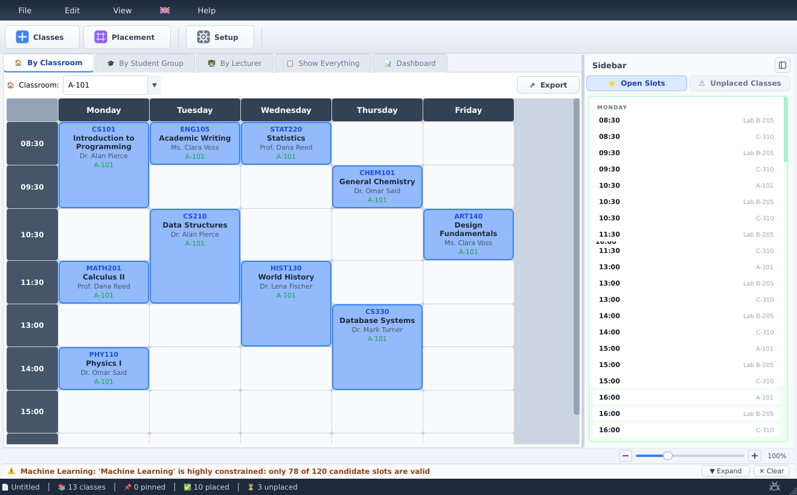
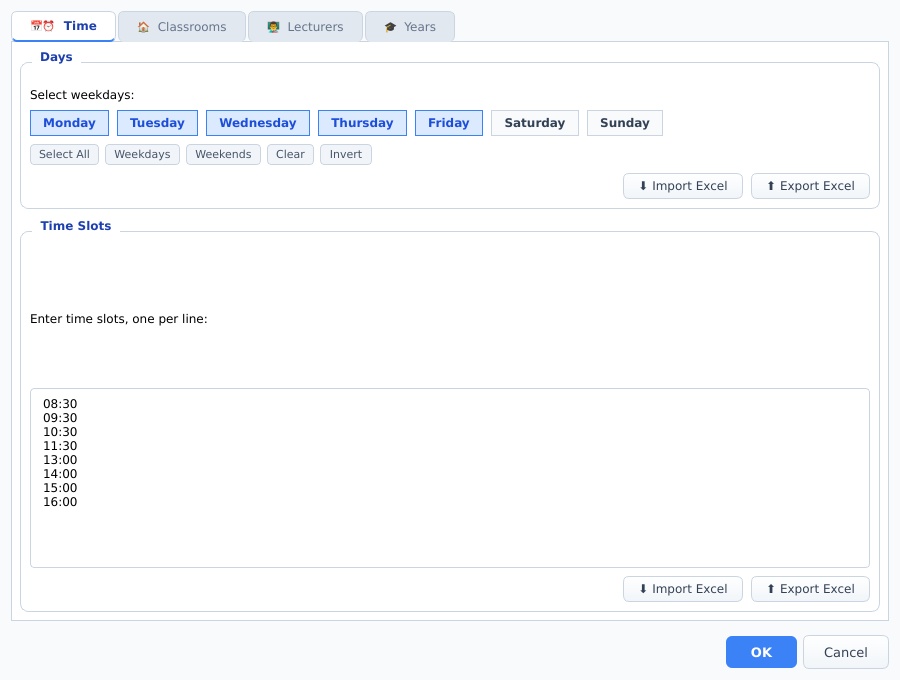
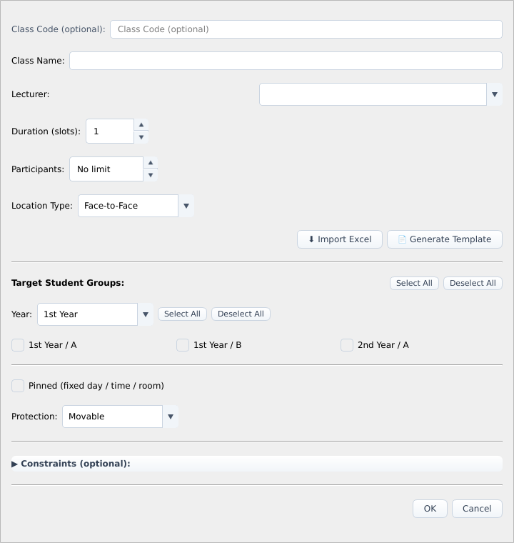
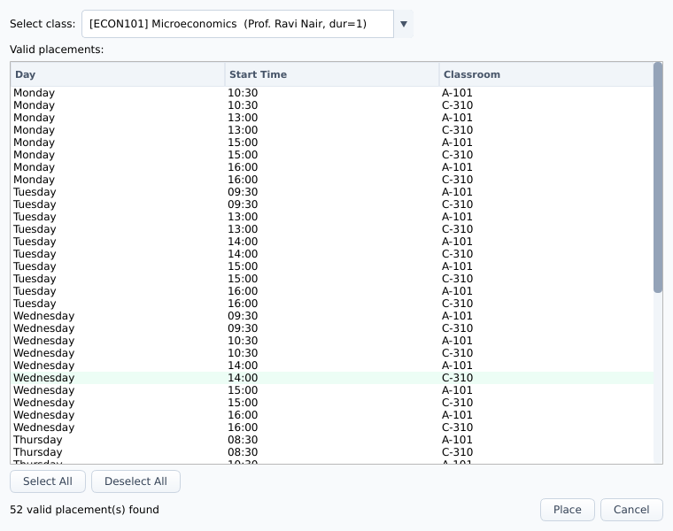
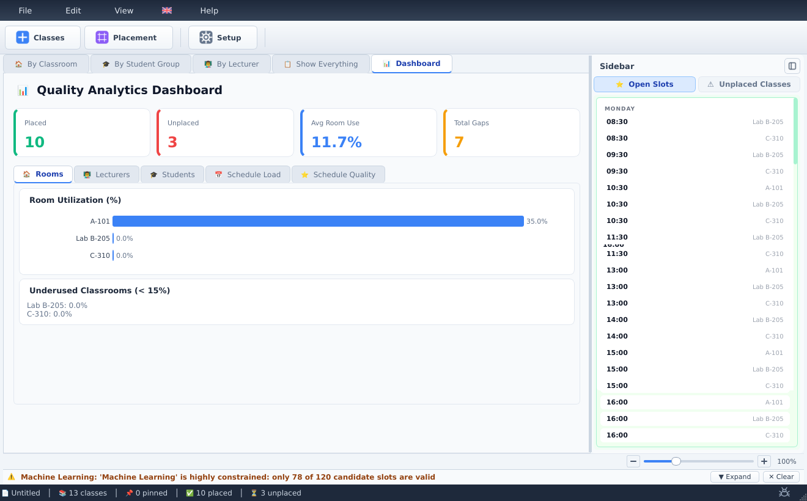

<!-- Language switcher -->
[](README-en.md)
[](README-tr.md)
[](README-de.md)
[](README-es.md)

<p align="center">
  
</p>

<h1 align="center">DERSİS</h1>

<p align="center"><b>Intelligent, fully offline class-timetable software for schools and universities.</b></p>

<p align="center">
  <a href="https://github.com/Oynthe/dersis-app/releases/latest"></a>
</p>

<p align="center">
  <sub>Windows installer · for the command line, see <a href="scripts/download_release.py"><code>scripts/download_release.py</code></a></sub>
</p>

---

## Table of Contents

- [Overview](#overview)
- [Screenshots](#screenshots)
- [Features](#features)
- [Installation for Everyone](#installation-for-everyone)
- [Running From Source](#running-from-source)
- [Project Structure](#project-structure)
- [Replication and Alternatives](#replication-and-alternatives)
- [Roadmap and Upgrade Possibilities](#roadmap-and-upgrade-possibilities)
- [Usage Guide](#usage-guide)
- [Reporting Bugs](#reporting-bugs)
- [License and Usage](#license-and-usage)

---

## Overview

**DERSİS** (from the Turkish *Ders Programı Hazırlama Sistemi*, "Class Schedule Preparation
System") is a desktop application that builds, optimizes, and manages **weekly class
timetables** for educational institutions.

Creating a timetable by hand is hard: you must make sure no teacher is in two places at
once, no room is double-booked, no student group has overlapping classes, every class fits
in the available hours, and rooms are never over capacity. On top of that, a *good*
timetable also keeps gaps small, spreads the load evenly across days, and respects everyone's
preferences. DERSİS does all of this for you, automatically, while keeping you in control.

It runs **entirely on your own computer**. There is **no login, no account, and no internet
connection required** — ever. You open the app and start working.

**Who it is for:** university scheduling offices, school administrators, department
coordinators, and anyone who needs conflict-free weekly schedules.

---

## Screenshots

<p align="center">
  
</p>
<p align="center"><i>The weekly timetable — classes placed per room, with live open-slot and unplaced-class panels and a quality warning in the status bar.</i></p>

### Setup and adding classes

<p align="center">
  
  &nbsp;
  
</p>
<p align="center"><i>Left: configure weekdays, time slots, rooms and student groups. Right: add a class with its lecturer, target groups, duration and protection level.</i></p>

### Smart placement and analytics

<p align="center">
  
  &nbsp;
  
</p>
<p align="center"><i>Left: conflict-aware placement lists every valid day/time/room for an unplaced class. Right: the analytics dashboard scores placement, room utilization and gaps.</i></p>

---

## Features

> Every feature below is implemented in the application. For the exact source location of
> each one, see [`docs/FEATURES.md`](docs/FEATURES.md).

### Scheduling engine
- **Automatic conflict prevention** — guards against teacher clashes, room clashes, student
  group overlaps, classes that are too long for the available hours, and rooms that are over
  capacity. It also respects each teacher's available days and hours.
- **Multi-engine optimizer** — combines three techniques: a fast heuristic placement pass, a
  Large Neighborhood Search (LNS) with 7 adaptive "destroy & repair" strategies, and the
  Google **OR-Tools CP-SAT** constraint solver for exact optimization.
- **14-parameter quality scoring** — balances teacher compactness, student gaps, daily load
  balance, fragmentation, room switching, time-of-day preferences, and more.
- **Difficulty-aware ordering** — the hardest-to-place classes are scheduled first.

### Smart placement
- **Auto-place a single class** into the best available slot.
- **Batch scheduling** of many unplaced classes at once.
- **Full reschedule** to optimize the entire timetable from scratch.
- **Drag-and-drop** placement on the grid with **real-time conflict checking** (a valid drop
  is highlighted green, an invalid one red).

### Explainable AI
- Every automatic placement comes with a **plain-language pros/cons breakdown**.
- When a move is rejected, the app explains **exactly which rule was broken**.
- Optimization runs end with a **quality verdict and before/after metrics**.
- **Constraint negotiation:** when a class simply cannot fit, the app suggests specific
  relaxations (or which existing class to move) to make room.

### Learning from you
- DERSİS **logs your manual moves and your accepted/rejected suggestions** and gradually
  adapts its scoring to match how you like to schedule. Learned preferences are saved and
  carried over between sessions.

### Control and protection
- **Protection levels** per class: movable, soft-protected, same-day only, improve-only,
  locked, or fully pinned.
- **Optimization goals:** six sliders (teacher compactness, student compactness, room
  utilization, fairness, minimal disruption, early-hour preference) and six ready-made
  presets (balanced, lecturer priority, student priority, minimal change, space efficient,
  morning friendly).
- **Change-impact analysis:** preview how a setup change would affect the current schedule
  before you commit to it.

### Views and analytics
- **Four ways to view** the timetable: by classroom, by lecturer, by student group, and a
  full "show everything" matrix.
- **Analytics dashboard** with a 0–100 quality score and an A–F grade, per-teacher,
  per-group and per-room metrics, charts, and actionable insights.

### Import and export
- **Excel import** of teachers, rooms, branches, and classes, with validation, duplicate
  detection, and automatic grouping of joint classes.
- **Excel template generator** that produces a ready-to-fill workbook with example rows in
  your chosen language.
- **Export** the finished timetable to **Excel** (color-coded, multi-sheet), **CSV**, and
  **PDF**.

### Experience and data handling
- **Multilingual interface** — more than 20 languages, chosen on first run from a flag-based
  picker (22 flag options), including right-to-left support for Arabic and Persian.
- **Interactive tutorial** — a guided, spotlight-style walkthrough for new users.
- **Fully offline** — no network calls of any kind; all features are unlocked locally.
- **Encrypted local storage** — schedules are saved in an encrypted `.egu` file format
  (AES-256-GCM) under your `Documents/Dersis/` folder, with autosave. What that buys you is
  integrity and opacity: a damaged or edited file is detected instead of silently loaded, and
  the saves are not readable in a text editor. It is **not** a lock on your data. The key is
  stored next to the saves, in `Documents/Dersis/keys/key.bin`, so anyone who can open that
  folder can read the schedules. If you need to keep other people out, use your operating
  system's account and folder permissions.
- **In-app bug reporting** — a built-in form prepares an email for you (see
  [Reporting Bugs](#reporting-bugs)); the app itself never transmits anything.

---

## Installation for Everyone

This section is for users who just want to **use** DERSİS, with no programming required.

### On Windows (recommended)

1. Obtain the installer file. It is named like **`Dersis_Setup_v1.0.0.exe`** (the version
   number may differ).
2. **Double-click** the installer and follow the on-screen wizard (choose a language, accept
   the agreement, pick an install location, then click *Install*).
3. When it finishes, launch **DERSİS** from the Start Menu or the desktop shortcut.
4. The app opens **straight into the main window** — there is no sign-up, login, or activation
   step.

> **Where your work is saved:** DERSİS stores everything inside your personal Documents
> folder, at `Documents\Dersis\` (schedules, settings, logs, and exports). Your data never
> leaves your computer.

### On macOS

**There is no ready-made Mac download yet.** Every release published so far carries a single
file — the Windows installer — and no Mac bundle has ever been attached to one. Earlier
versions of this README listed Mac files that were never there.

The macOS build itself is real and works: on a Mac you can produce a native `Dersis.app` and
package it, in a few minutes, from the source in this repository. See
[Running From Source](#running-from-source) for the build steps and
[`docs/MACOS.md`](docs/MACOS.md) for the Mac-specific guidance.

> **First launch — security warning:** an app you built yourself is unsigned, so macOS may
> show a security warning the first time you open it. Open it via **System Settings →
> Privacy & Security**, or by **right-clicking the app and selecting Open**. Full guidance
> (including the `xattr -dr com.apple.quarantine` fix) is in
> [`docs/MACOS.md`](docs/MACOS.md).

### On other systems

The application itself is built with Python and the Qt toolkit and can also run on Linux
(see [Running From Source](#running-from-source)). A ready-made Linux package is not yet
provided.

---

## Running From Source

This section is for people comfortable with a command line who want to run or build DERSİS
themselves. You need **Python 3.10 or newer**.

**On Windows the short version is two scripts** — run `setup.bat` once, then
`run.bat` whenever you want to start the app. Both work when double-clicked and
neither needs an activated environment. The steps below are what they do, and
are also the Linux/macOS route.

### 1. Get the code and install dependencies

```bash
# Create an isolated environment
python -m venv .venv

# Activate it
.venv\Scripts\activate        # Windows
source .venv/bin/activate      # Linux / macOS

# Install the required libraries
pip install -r requirements.txt
```

> On **Linux**, you also need the system Qt libraries that PyQt6 depends on (install them
> through your distribution's package manager if the app fails to start).

### 2. Run the app

```bash
python scheduler_gui.py
```

### 3. (Optional) Build a Windows installer

The recommended packaging method bundles a private copy of Python so the result runs on any
Windows 10/11 (64-bit) machine with no extra setup:

```bat
build_embed.bat          :: produces build\Dersis.dist\
iscc installer.iss       :: produces Output\Dersis_Setup_v<version>.exe
```

`build_embed.bat` downloads the official Python embeddable runtime, installs all pinned
dependencies from `requirements-lock.txt`, verifies them with `verify_deps.py`, copies the
app and its assets, and creates the launchers. A second method using **Nuitka**
(`build_nuitka.bat`) compiles to native code. Full details, required tools (Inno Setup), and
options are in [`BUILD.md`](BUILD.md).

### 4. (Optional) Build a macOS app (.dmg) — on a Mac

On macOS, PyInstaller builds a native `Dersis.app` which is then packaged into a `.dmg`
(plus an optional `.zip`). No Apple Developer Program membership is needed for a local build:

```bash
./build_mac.sh           # build for your Mac's architecture
./build_mac.sh arm64     # Apple Silicon
./build_mac.sh x64       # Intel
```

Outputs land in `dist/` as `Dersis-<version>-mac-<arch>.dmg` (and `.zip`). Builds are
ad-hoc signed by default; signing with a Developer ID and notarization are optional. See the
full [macOS guide](docs/MACOS.md).

---

## Project Structure

```
scheduler_gui.py              Entry point — launches the app
scheduler_app/
  core/         Scheduling engine: data models, conflict rules, the multi-engine
                optimizer (heuristic + LNS + CP-SAT), scoring, analytics, and the
                explanation engine. No UI code lives here.
  ui/           The PyQt6 interface: main window, all dialogs, the drag-and-drop
                timetable renderer, the analytics dashboard, the tutorial, and the
                multi-language translation tables.
  data_io/      Excel/CSV/PDF import and export, plus the Excel template generator.
  learning/     Logs your interactions and adapts the scoring weights over time.
  storage/      Encrypted .egu file format (AES-256-GCM) and file-path management.
  assets/       Application icons.
flags/          Country flag images used by the language picker.
docs/           Documentation and the application logo.
installer/      Inno Setup assets (license text shown by the installer, wizard images).
VERSION         The single source of truth for the version number.
build_embed.bat / build_nuitka.bat / installer.iss   Build and packaging scripts.
```

A complete, file-by-file breakdown is in [`docs/STRUCTURE.md`](docs/STRUCTURE.md), and a deep
architectural map is in the [`dersis-mapped/`](dersis-mapped/) folder.

---

## Replication and Alternatives

If you are a developer or an institution that wants to build something similar — or reproduce
this exact setup — here is what DERSİS is made of and how the pieces fit together.

**Technology stack**

| Concern | Technology used here | Common alternatives |
|---|---|---|
| Desktop UI | PyQt6 (Qt 6) | PySide6, Tkinter, a web UI (Electron / browser) |
| Exact optimization | Google OR-Tools CP-SAT | Other CP/MILP solvers (e.g., CP-Optimizer, Gurobi) |
| Heuristic search | Custom heuristic + Large Neighborhood Search | Simulated annealing, genetic algorithms, tabu search |
| Spreadsheet I/O | openpyxl + pandas | xlsxwriter, csv module only |
| PDF output | reportlab | WeasyPrint, fpdf2 |
| At-rest obfuscation + integrity | `cryptography` (AES-256-GCM), key stored beside the data | SQLCipher, OS keychain integration |
| Windows packaging | Embeddable Python + Inno Setup | PyInstaller, Nuitka, MSIX |
| macOS packaging | PyInstaller `.app` → `.dmg` | py2app, Briefcase |

**Architectural approach to reproduce**

1. **Keep the engine UI-free.** The whole `core/` package operates on plain Python
   dictionaries, which makes it easy to test, serialize, and run in parallel processes,
   independently of the interface.
2. **Model hard vs. soft constraints separately.** Hard constraints (no clashes) are enforced
   absolutely; soft objectives (compactness, balance) are turned into a weighted score.
3. **Layer the optimizers.** Start with a fast heuristic, improve it with local search, then
   optionally call an exact solver — feeding each stage's result into the next.
4. **Make decisions explainable.** Generating a human-readable reason alongside every
   automated choice is what turns a black-box solver into a tool people trust.
5. **Package with a bundled runtime.** Shipping a private Python build (the embeddable
   method) avoids "it works on my machine" problems for non-technical end users.

You are welcome to study the structure for your own learning. Note the
[license terms](#license-and-usage) before any institutional reuse.

---

## Roadmap and Upgrade Possibilities

These are **realistic, not-yet-committed** directions, listed so you can judge feasibility.
Items here are possibilities (*to be confirmed*), not promises.

- **Published Mac and Linux builds.** Build scripts exist for Windows (Inno Setup) and macOS
  (PyInstaller), but only the Windows installer is attached to releases today; publishing the
  Mac build, and adding a native Linux package (AppImage / .deb), are both feasible next
  steps since the app code is cross-platform.
- **macOS notarization.** macOS builds are currently unsigned/ad-hoc; signing with an Apple
  Developer ID and notarizing (to remove the Gatekeeper prompt) is wired for credentials but
  not yet automated in CI.
- **An automated test suite.** The repository currently ships **without test files**;
  continuous integration runs only version, build-file, and import-smoke checks. Adding unit
  tests around the `core/` engine would be a high-value, low-risk improvement.
- **Completing installer translations.** The app interface covers 20+ languages, but the
  Windows installer wizard currently ships in 13. The remaining wizard translations could be
  added.
- **Optional multi-user / cloud sync.** DERSİS is fully offline by design today; an optional,
  opt-in sync or shared-database mode would be a substantial but feasible addition.
- **Plugin or scripting surface.** Because the engine is UI-free and dictionary-based, a
  public API or plugin hook for custom constraints/objectives is technically straightforward.
- **More export formats / templates.** Additional report layouts could be added on top of the
  existing Excel/CSV/PDF exporters.

---

## Usage Guide

A complete walkthrough of the main workflow. (Keyboard shortcuts shown in parentheses.)

### 1. First run
On the very first launch, pick your **language** from the flag-based picker. An optional
**interactive tutorial** then offers a guided tour — you can take it or skip it and replay it
later from **Help → Tutorial**.

### 2. Set up your environment (Edit → Edit Setup)
Define the basics your timetable is built from:
- **Days** — which weekdays are active (e.g. Monday–Friday).
- **Time slots** — the available hours each day (e.g. 09:00, 10:00, …).
- **Classrooms** — each room's name and capacity.
- **Years and branches** — your student groups (e.g. *Year 1 – Computer Science*).
- **Lecturers** — teaching staff, with optional available/unavailable days and hours.

### 3. Add your classes
- **Add a single class** (`Ctrl+Shift+A`): give it a name (and optional code), a lecturer,
  a duration (how many consecutive slots), the target student group(s), the number of
  participants, and a location type (face-to-face, online, or lecturer's office). You can
  optionally **pin** it to a fixed day/time/room or add **constraints** (allowed/excluded
  days, times, or rooms).
- **Bulk add** (`Ctrl+Shift+B`): fill a spreadsheet-style table and schedule many classes at
  once.
- **Import from Excel:** generate the template, fill it in, and import — DERSİS validates the
  data and reports any problems before adding the classes.

### 4. Place the classes
- **Drag and drop** any class onto the grid; the app validates the move instantly.
- **Auto-place a single class** (`Ctrl+P`): the app proposes the best slot with an
  explanation; accept it or review alternatives.
- **Batch schedule** all unplaced classes in one operation.
- **Full reschedule** (`Ctrl+R`): re-optimize the whole timetable.

### 5. Review and adjust
Switch between the **by-classroom**, **by-lecturer**, **by-student-group**, and **show
everything** views. Classes are color-coded by year group and carry badges for their
protection level. Any conflict or warning is shown clearly; right-click a class for quick
actions (place, unplace, pin, protect, edit, delete).

### 6. Optimize toward your priorities
Open the reschedule dialog and set the **goal sliders** or pick a **preset**. Run it, then
read the results summary — what moved, what (if anything) couldn't be placed, and how the
overall quality changed.

### 7. Analyze quality
Open the **Dashboard** for the 0–100 quality score and A–F grade, plus tabs for rooms,
lecturers, students, and overall load, with charts and improvement suggestions.

### 8. Export and share
Export the finished timetable to **Excel**, **CSV**, or **PDF** from the File menu or each
view's export button.

### 9. Save and reload
- **Save** (`Ctrl+S`) — writes an autosave plus a timestamped, encrypted `.egu` file under
  `Documents\Dersis\saves\`.
- **Open** (`Ctrl+O`), **New** (`Ctrl+N`), **Undo** (`Ctrl+Z`), **Redo** (`Ctrl+Y`).

---

## Reporting Bugs

Found a problem or have a suggestion? There are two easy ways to report it.

1. **From inside the app:** use the **Report Bug** button. If the app ever crashes, a safe
   crash dialog appears too. Both prepare an email for you — filled in with the app version,
   your operating system, severity, and steps — and open it in your default email program.
   **The app sends nothing on its own;** you stay in control of the message. If no email
   program is set up, the report text is copied to your clipboard so you can paste it.

2. **By email directly:** write to **[dersis.app@gmail.com](mailto:dersis.app@gmail.com)**.
   Please describe what you did, what you expected, and what happened instead — and mention
   your DERSİS version and operating system.

---

## License and Usage

**DERSİS is now free for all individual users.** You may download, install, and use it for
your personal work at no cost.

**Institutions need a license for institutional use.** Institutions — including
**universities, faculties, schools, departments, research centers, administrative units, or
any university sub-body** — **may not embed, integrate, deploy, or officially incorporate
DERSİS into their own institutional systems without paying a licensing or integration fee.**

If your institution wants **institutional use, integration, embedding, deployment,
customization, or official adoption**, please get in touch to arrange a license:

> **Contact for institutional licensing:**
> [dersis.app@gmail.com](mailto:dersis.app@gmail.com)

See the top-level [`LICENSE.md`](LICENSE.md) for the full terms.

---

<p align="center">
  <a href="README-en.md">English</a> ·
  <a href="README-tr.md">Türkçe</a> ·
  <a href="README-de.md">Deutsch</a> ·
  <a href="README-es.md">Español</a>
</p>
