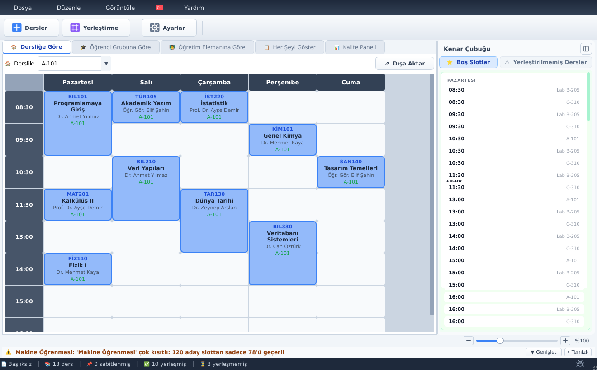
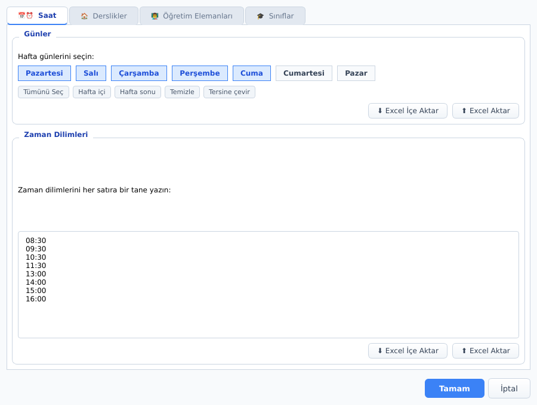
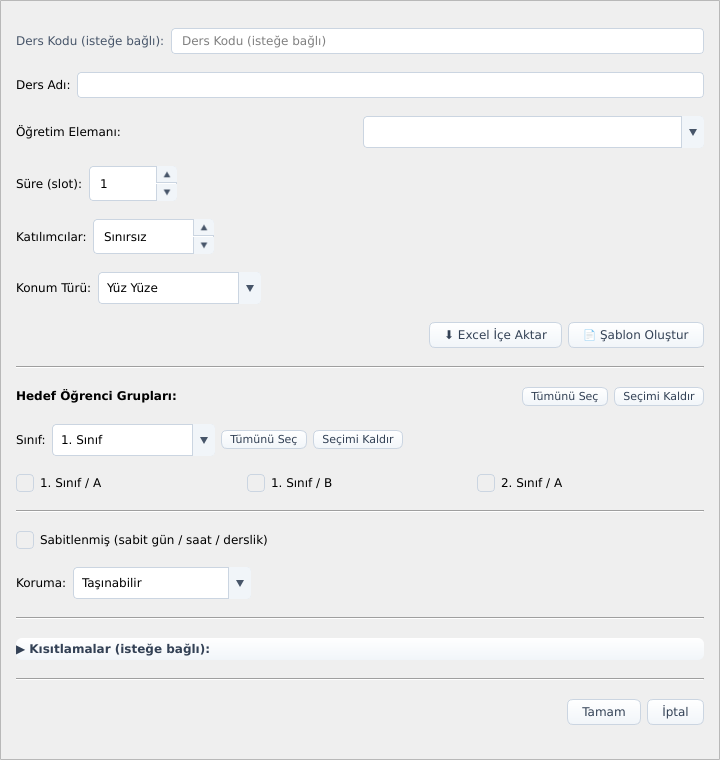
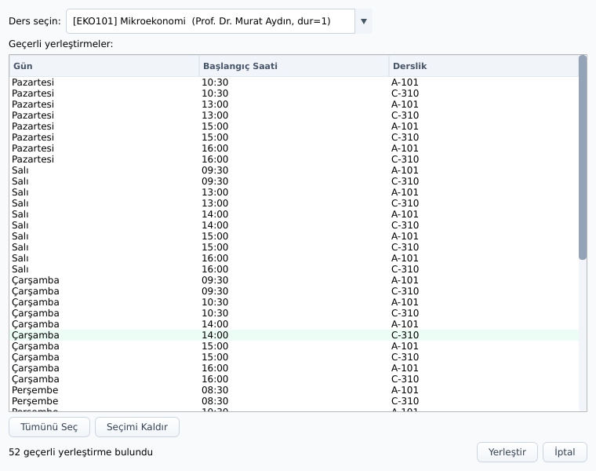
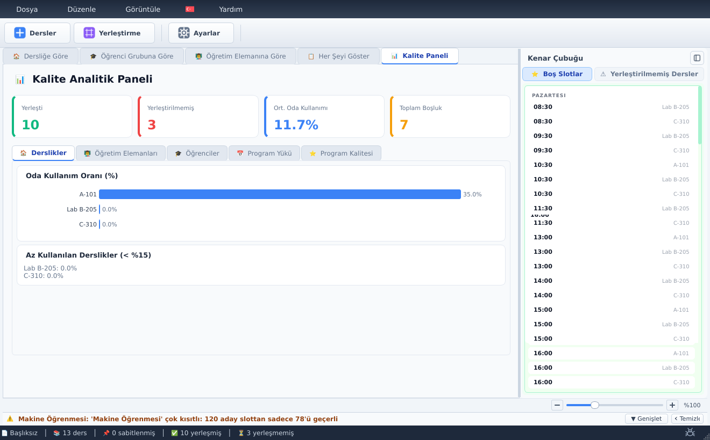

<!-- Dil seçici -->
[](README-en.md)
[](README-tr.md)
[](README-de.md)
[](README-es.md)

<p align="center">
  
</p>

<h1 align="center">DERSİS</h1>

<p align="center"><b>Okullar ve üniversiteler için akıllı, tamamen çevrimdışı ders programı yazılımı.</b></p>

<p align="center">
  <a href="https://github.com/Oynthe/dersis-app/releases/latest"></a>
</p>

<p align="center">
  <sub>Windows yükleyicisini indirin · komut satırı için <a href="scripts/download_release.py"><code>scripts/download_release.py</code></a></sub>
</p>

---

## İçindekiler

- [Genel Bakış](#genel-bakış)
- [Ekran Görüntüleri](#ekran-görüntüleri)
- [Özellikler](#özellikler)
- [Kurulum](#kurulum)
- [Kaynak Koddan Çalıştırma](#kaynak-koddan-çalıştırma)
- [Proje Yapısı](#proje-yapısı)
- [Çoğaltma ve Alternatifler](#çoğaltma-ve-alternatifler)
- [Yol Haritası ve Geliştirme Olanakları](#yol-haritası-ve-geliştirme-olanakları)
- [Kullanım Kılavuzu](#kullanım-kılavuzu)
- [Hata Bildirimi](#hata-bildirimi)
- [Lisans ve Kullanım](#lisans-ve-kullanım)

---

## Genel Bakış

**DERSİS** (Ders Programı Hazırlama Sistemi), eğitim kurumları için **haftalık ders
programları** oluşturan, eniyileyen ve yöneten bir masaüstü uygulamasıdır.

Ders programını elle hazırlamak zordur: hiçbir öğretim elemanının aynı anda iki yerde
olmamasını, hiçbir dersliğin çift rezerve edilmemesini, hiçbir öğrenci grubunun derslerinin
çakışmamasını, her dersin uygun saatlere sığmasını ve dersliklerin kapasitesinin
aşılmamasını aynı anda sağlamanız gerekir. Üstüne üstlük, *iyi* bir programın boşlukları az
tutması, günlere dengeli dağılması ve tercihlere uyması da beklenir. DERSİS tüm bunları sizin
adınıza, otomatik olarak yapar — üstelik kontrol her zaman sizde kalır.

Uygulama **tamamen kendi bilgisayarınızda** çalışır. **Hesap, giriş ya da internet bağlantısı
gerektirmez** — hiçbir zaman. Uygulamayı açar ve çalışmaya başlarsınız.

**Kimler için:** üniversite ders programı birimleri, okul yöneticileri, bölüm
koordinatörleri ve çakışmasız haftalık programlara ihtiyaç duyan herkes.

---

## Ekran Görüntüleri

<p align="center">
  
</p>
<p align="center"><i>Haftalık ders programı — dersler dersliklere yerleştirilmiş; canlı boş slot ve yerleştirilmemiş ders panelleri ile durum çubuğunda bir kalite uyarısı.</i></p>

### Kurulum ve ders ekleme

<p align="center">
  
  &nbsp;
  
</p>
<p align="center"><i>Solda: hafta günlerini, zaman dilimlerini, derslikleri ve öğrenci gruplarını yapılandırın. Sağda: öğretim elemanı, hedef gruplar, süre ve koruma düzeyiyle bir ders ekleyin.</i></p>

### Akıllı yerleştirme ve analizler

<p align="center">
  
  &nbsp;
  
</p>
<p align="center"><i>Solda: çakışmaya duyarlı yerleştirme, yerleştirilmemiş bir ders için geçerli tüm gün/saat/derslik seçeneklerini listeler. Sağda: analiz paneli yerleştirmeyi, derslik kullanımını ve boşlukları puanlar.</i></p>

---

## Özellikler

> Aşağıdaki her özellik uygulamada gerçekten mevcuttur. Her birinin tam kaynak kodu konumu
> için [`docs/FEATURES.md`](docs/FEATURES.md) belgesine bakın.

### Programlama motoru
- **Otomatik çakışma önleme** — öğretim elemanı çakışmaları, derslik çakışmaları, öğrenci
  grubu örtüşmeleri, mevcut saatlere sığmayacak kadar uzun dersler ve kapasitesi aşılan
  derslikler için koruma sağlar. Ayrıca her öğretim elemanının uygun gün ve saatlerine uyar.
- **Çok motorlu eniyileyici** — üç tekniği birleştirir: hızlı bir sezgisel yerleştirme
  aşaması, 7 uyarlanabilir "boz ve onar" stratejisiyle çalışan Büyük Komşuluk Araması (LNS)
  ve kesin eniyileme için Google **OR-Tools CP-SAT** kısıt çözücüsü.
- **14 parametreli kalite puanlaması** — öğretim elemanı yoğunluğu, öğrenci boşlukları,
  günlük yük dengesi, parçalanma, derslik değişimi, günün saatine göre tercihler ve daha
  fazlasını dengeler.
- **Zorluk önceliklendirme** — yerleştirmesi en zor dersler önce planlanır.

### Akıllı yerleştirme
- Tek bir dersi **en uygun boş slota otomatik yerleştirme**.
- Yerleştirilmemiş çok sayıda dersi tek seferde **toplu programlama**.
- Tüm programı sıfırdan eniyilemek için **tam yeniden programlama**.
- Izgara üzerinde **sürükle-bırak** ile **anlık çakışma denetimi** (geçerli bırakma yeşil,
  geçersiz bırakma kırmızı vurgulanır).

### Açıklanabilir yapay zekâ
- Her otomatik yerleştirme, **sade bir dille artı/eksi dökümüyle** sunulur.
- Bir hamle reddedildiğinde, uygulama **tam olarak hangi kuralın çiğnendiğini** açıklar.
- Eniyileme çalışmaları **bir kalite değerlendirmesi ve önce/sonra ölçümleriyle** sonuçlanır.
- **Kısıt müzakeresi:** bir ders bir türlü sığmadığında, uygulama yer açmak için belirli
  gevşetmeler (ya da hangi mevcut dersin taşınacağını) önerir.

### Sizden öğrenme
- DERSİS, **elle yaptığınız taşımaları ve kabul/ret kararlarınızı kaydeder** ve programlama
  tarzınıza uyacak şekilde puanlamasını kademeli olarak uyarlar. Öğrenilen tercihler
  kaydedilir ve oturumlar arasında korunur.

### Denetim ve koruma
- Ders başına **koruma düzeyleri**: taşınabilir, esnek korumalı, yalnızca aynı gün, yalnızca
  iyileştirirse, kilitli veya tamamen sabitlenmiş.
- **Eniyileme hedefleri:** altı kaydırıcı (öğretim elemanı yoğunluğu, öğrenci yoğunluğu,
  derslik kullanımı, adalet, en az değişiklik, erken saat tercihi) ve altı hazır profil
  (dengeli, öğretim elemanı öncelikli, öğrenci öncelikli, en az değişiklik, alanı verimli,
  sabaha uygun).
- **Değişiklik etki analizi:** bir kurulum değişikliğinin mevcut programı nasıl
  etkileyeceğini, uygulamadan önce önizleyin.

### Görünümler ve analitik
- Programı **dört farklı şekilde görüntüleme**: dersliğe göre, öğretim elemanına göre,
  öğrenci grubuna göre ve "her şeyi göster" matris görünümü.
- 0–100 kalite puanı ve A–F notu, öğretim elemanı/grup/derslik başına ölçümler, grafikler ve
  uygulanabilir öneriler içeren **analitik gösterge paneli**.

### İçe ve dışa aktarma
- Öğretim elemanları, derslikler, şubeler ve derslerin **Excel ile içe aktarımı**;
  doğrulama, yinelenen kayıt tespiti ve ortak derslerin otomatik gruplanmasıyla.
- Seçtiğiniz dilde örnek satırlar içeren, doldurmaya hazır bir çalışma kitabı üreten **Excel
  şablon oluşturucu**.
- Tamamlanan programı **Excel** (renk kodlu, çok sayfalı), **CSV** ve **PDF** olarak **dışa
  aktarma**.

### Deneyim ve gizlilik
- **Çok dilli arayüz** — 20'den fazla dil; ilk açılışta bayrak tabanlı bir seçiciden seçilir
  (22 bayrak seçeneği), Arapça ve Farsça için sağdan sola yazım desteği dâhil.
- **Etkileşimli eğitim turu** — yeni kullanıcılar için rehberli, ışık-spot tarzı bir tanıtım.
- **Tamamen çevrimdışı** — hiçbir türde ağ bağlantısı yoktur; tüm özellikler yerel olarak
  açıktır.
- **Şifreli yerel depolama** — programlar, `Documents/Dersis/` klasörünüzde şifreli `.egu`
  dosya biçiminde (AES-256-GCM) ve otomatik kaydetmeyle saklanır.
- **Uygulama içi hata bildirimi** — yerleşik bir form sizin için bir e-posta hazırlar
  (bkz. [Hata Bildirimi](#hata-bildirimi)); uygulamanın kendisi hiçbir şey göndermez.

---

## Kurulum

Bu bölüm, herhangi bir programlama bilgisi gerekmeden DERSİS'i yalnızca **kullanmak**
isteyenler içindir.

### Windows'ta (önerilen)

1. Kurulum dosyasını edinin. Adı **`Dersis_Setup_v1.0.0.exe`** gibidir (sürüm numarası
   değişebilir).
2. Kurulum dosyasına **çift tıklayın** ve ekrandaki sihirbazı izleyin (bir dil seçin,
   sözleşmeyi kabul edin, kurulum konumunu belirleyin ve *Kur*'a tıklayın).
3. İşlem bittiğinde **DERSİS**'i Başlat Menüsü'nden veya masaüstü kısayolundan başlatın.
4. Uygulama **doğrudan ana pencereye** açılır — kayıt, giriş veya etkinleştirme adımı yoktur.

> **Çalışmalarınız nereye kaydedilir:** DERSİS her şeyi kişisel Belgeler klasörünüzün
> içinde, `Documents\Dersis\` konumunda saklar (programlar, ayarlar, günlükler ve dışa
> aktarmalar). Verileriniz asla bilgisayarınızdan çıkmaz.

### Diğer sistemlerde

Uygulama Python ve Qt araç takımıyla geliştirilmiştir ve Linux'ta da çalışabilir
(bkz. [Kaynak Koddan Çalıştırma](#kaynak-koddan-çalıştırma)). **Hazır kurulum dosyası şu an
yalnızca Windows içindir.** macOS desteği *teyit edilecek*.

---

## Kaynak Koddan Çalıştırma

Bu bölüm, DERSİS'i kendisi çalıştırmak veya derlemek isteyen, komut satırına aşina kişiler
içindir. **Python 3.10 veya üzeri** gereklidir.

### 1. Kodu alın ve bağımlılıkları kurun

```bash
# Yalıtılmış bir ortam oluşturun
python -m venv .venv

# Etkinleştirin
.venv\Scripts\activate        # Windows
source .venv/bin/activate      # Linux / macOS

# Gerekli kütüphaneleri kurun
pip install -r requirements.txt
```

> **Linux'ta** ayrıca PyQt6'nın dayandığı sistem Qt kütüphaneleri de gereklidir (uygulama
> başlamazsa dağıtımınızın paket yöneticisiyle kurun).

### 2. Uygulamayı çalıştırın

```bash
python scheduler_gui.py
```

### 3. (İsteğe bağlı) Windows kurulum dosyası oluşturma

Önerilen paketleme yöntemi, sonucun ek bir kurulum gerektirmeden herhangi bir Windows 10/11
(64-bit) makinede çalışması için özel bir Python kopyasını paketler:

```bat
build_embed.bat          :: build\Dersis.dist\ klasörünü üretir
iscc installer.iss       :: Output\Dersis_Setup_v<sürüm>.exe dosyasını üretir
```

`build_embed.bat`, resmî Python gömülebilir çalışma zamanını indirir,
`requirements-lock.txt` dosyasındaki sabitlenmiş tüm bağımlılıkları kurar, bunları
`verify_deps.py` ile doğrular, uygulamayı ve varlıklarını kopyalar ve başlatıcıları
oluşturur. **Nuitka** kullanan ikinci bir yöntem (`build_nuitka.bat`) yerel koda derler. Tüm
ayrıntılar, gerekli araçlar (Inno Setup) ve seçenekler [`BUILD.md`](BUILD.md) içindedir.

---

## Proje Yapısı

```
scheduler_gui.py              Giriş noktası — uygulamayı başlatır
scheduler_app/
  core/         Programlama motoru: veri modelleri, çakışma kuralları, çok motorlu
                eniyileyici (sezgisel + LNS + CP-SAT), puanlama, analitik ve açıklama
                motoru. Burada arayüz kodu bulunmaz.
  ui/           PyQt6 arayüzü: ana pencere, tüm iletişim kutuları, sürükle-bırak ders
                programı çizici, analitik gösterge paneli, eğitim turu ve çok dilli
                çeviri tabloları.
  data_io/      Excel/CSV/PDF içe ve dışa aktarma, ayrıca Excel şablon oluşturucu.
  learning/     Etkileşimlerinizi kaydeder ve zamanla puanlama ağırlıklarını uyarlar.
  storage/      Şifreli .egu dosya biçimi (AES-256-GCM) ve dosya yolu yönetimi.
  assets/       Uygulama simgeleri.
flags/          Dil seçicide kullanılan ülke bayrağı görselleri.
docs/           Belgeler ve uygulama logosu.
installer/      Inno Setup varlıkları (kurulumda gösterilen lisans metni, sihirbaz görselleri).
VERSION         Sürüm numarası için tek doğruluk kaynağı.
build_embed.bat / build_nuitka.bat / installer.iss   Derleme ve paketleme betikleri.
```

Dosya dosya tam bir döküm [`docs/STRUCTURE.md`](docs/STRUCTURE.md) içinde, derin bir mimari
harita ise [`dersis-mapped/`](dersis-mapped/) klasöründedir.

---

## Çoğaltma ve Alternatifler

Benzer bir şey geliştirmek — veya tam olarak bu kurulumu yeniden üretmek — isteyen bir
geliştirici ya da kurumsanız, DERSİS'in nelerden oluştuğu ve parçaların nasıl bir araya
geldiği aşağıdadır.

**Teknoloji yığını**

| Konu | Burada kullanılan | Yaygın alternatifler |
|---|---|---|
| Masaüstü arayüz | PyQt6 (Qt 6) | PySide6, Tkinter, web arayüzü (Electron / tarayıcı) |
| Kesin eniyileme | Google OR-Tools CP-SAT | Diğer CP/MILP çözücüler (ör. CP-Optimizer, Gurobi) |
| Sezgisel arama | Özel sezgisel + Büyük Komşuluk Araması | Tavlama benzetimi, genetik algoritmalar, tabu arama |
| Excel okuma/yazma | openpyxl + pandas | xlsxwriter, yalnızca csv modülü |
| PDF çıktısı | reportlab | WeasyPrint, fpdf2 |
| Diskte şifreleme | `cryptography` (AES-256-GCM) | SQLCipher, işletim sistemi anahtarlığı |
| Windows paketleme | Gömülebilir Python + Inno Setup | PyInstaller, Nuitka, MSIX |

**Yeniden üretmek için mimari yaklaşım**

1. **Motoru arayüzden ayrı tutun.** Tüm `core/` paketi sade Python sözlükleriyle çalışır;
   bu da arayüzden bağımsız olarak test etmeyi, serileştirmeyi ve paralel süreçlerde
   çalıştırmayı kolaylaştırır.
2. **Katı ve esnek kısıtları ayrı modelleyin.** Katı kısıtlar (çakışma yok) mutlak olarak
   uygulanır; esnek hedefler (yoğunluk, denge) ağırlıklı bir puana dönüştürülür.
3. **Eniyileyicileri katmanlayın.** Hızlı bir sezgiselle başlayın, yerel aramayla
   iyileştirin, ardından isteğe bağlı olarak kesin bir çözücü çağırın — her aşamanın
   sonucunu bir sonrakine besleyin.
4. **Kararları açıklanabilir yapın.** Her otomatik seçimin yanında okunabilir bir gerekçe
   üretmek, bir kara kutu çözücüyü insanların güvendiği bir araca dönüştüren şeydir.
5. **Çalışma zamanını paketleyerek dağıtın.** Özel bir Python derlemesi göndermek (gömülebilir
   yöntem), teknik olmayan kullanıcılar için "benim makinemde çalışıyordu" sorunlarını önler.

Yapıyı kendi öğreniminiz için inceleyebilirsiniz. Her türlü kurumsal yeniden kullanımdan önce
[lisans koşullarına](#lisans-ve-kullanım) bakın.

---

## Yol Haritası ve Geliştirme Olanakları

Bunlar **gerçekçi, henüz taahhüt edilmemiş** yönlerdir; fizibiliteyi
değerlendirebilmeniz için listelenmiştir. Buradaki maddeler birer olasılıktır
(*teyit edilecek*), vaat değildir.

- **macOS ve Linux için yerel kurulum dosyaları.** Derleme betikleri şu an Windows `.bat`
  dosyalarıdır; uygulama kodu çapraz platformdur, dolayısıyla platforma özgü paketleme
  yapılabilir.
- **Otomatik test paketi.** Depo şu an **test dosyası içermez**; sürekli entegrasyon yalnızca
  sürüm, derleme dosyası ve içe aktarma denetimleri çalıştırır. `core/` motoru çevresine
  birim testleri eklemek, yüksek değerli ve düşük riskli bir iyileştirme olur.
- **Kurulum çevirilerinin tamamlanması.** Uygulama arayüzü 20'den fazla dili kapsar, ancak
  Windows kurulum sihirbazı şu an 13 dilde gelir. Kalan sihirbaz çevirileri eklenebilir.
- **İsteğe bağlı çok kullanıcılı / bulut eşitleme.** DERSİS bugün tasarım gereği tamamen
  çevrimdışıdır; isteğe bağlı, tercihe dayalı bir eşitleme veya paylaşımlı veritabanı kipi
  kapsamlı ama uygulanabilir bir ekleme olur.
- **Eklenti veya betikleme arayüzü.** Motor arayüzden bağımsız ve sözlük tabanlı olduğundan,
  özel kısıt/hedefler için bir genel API veya eklenti kancası teknik olarak kolaydır.
- **Daha fazla dışa aktarma biçimi / şablon.** Mevcut Excel/CSV/PDF dışa aktarıcılarının
  üzerine ek rapor düzenleri eklenebilir.

---

## Kullanım Kılavuzu

Ana iş akışının eksiksiz bir gezintisi. (Klavye kısayolları parantez içinde gösterilir.)

### 1. İlk açılış
İlk başlatmada bayrak tabanlı seçiciden **dilinizi** seçin. Ardından isteğe bağlı bir
**etkileşimli eğitim turu** rehberli bir gezinti sunar — turu alabilir veya atlayıp daha
sonra **Yardım → Eğitim** menüsünden tekrar oynatabilirsiniz.

### 2. Ortamınızı kurun (Düzen → Kurulumu Düzenle)
Programınızın üzerine kurulacağı temelleri tanımlayın:
- **Günler** — hangi hafta günleri etkin (ör. Pazartesi–Cuma).
- **Saat dilimleri** — her gün mevcut saatler (ör. 09:00, 10:00, …).
- **Derslikler** — her dersliğin adı ve kapasitesi.
- **Sınıflar ve şubeler** — öğrenci gruplarınız (ör. *1. Sınıf – Bilgisayar Bilimi*).
- **Öğretim elemanları** — öğretim kadrosu; isteğe bağlı uygun/uygun olmayan gün ve saatlerle.

### 3. Derslerinizi ekleyin
- **Tek ders ekleme** (`Ctrl+Shift+A`): bir ad (ve isteğe bağlı kod), bir öğretim elemanı,
  bir süre (kaç ardışık slot), hedef öğrenci grubu/grupları, katılımcı sayısı ve bir konum
  türü (yüz yüze, çevrimiçi veya öğretim elemanı ofisi) verin. İsteğe bağlı olarak dersi
  sabit bir gün/saat/dersliğe **sabitleyebilir** veya **kısıtlar** ekleyebilirsiniz (izin
  verilen/dışlanan günler, saatler veya derslikler).
- **Toplu ekleme** (`Ctrl+Shift+B`): elektronik tablo benzeri bir tabloyu doldurun ve çok
  sayıda dersi tek seferde programlayın.
- **Excel'den içe aktarma:** şablonu oluşturun, doldurun ve içe aktarın — DERSİS verileri
  doğrular ve dersleri eklemeden önce varsa sorunları bildirir.

### 4. Dersleri yerleştirin
- Herhangi bir dersi ızgaraya **sürükleyip bırakın**; uygulama hamleyi anında doğrular.
- **Tek dersi otomatik yerleştirme** (`Ctrl+P`): uygulama en iyi slotu bir açıklamayla
  önerir; kabul edin veya alternatifleri inceleyin.
- Yerleştirilmemiş tüm dersleri tek işlemde **toplu programlama**.
- **Tam yeniden programlama** (`Ctrl+R`): tüm programı yeniden eniyileyin.

### 5. Gözden geçirin ve düzenleyin
**Dersliğe göre**, **öğretim elemanına göre**, **öğrenci grubuna göre** ve **her şeyi
göster** görünümleri arasında geçiş yapın. Dersler sınıf düzeyine göre renk kodludur ve
koruma düzeyleri için rozet taşır. Her çakışma veya uyarı açıkça gösterilir; hızlı işlemler
için bir derse sağ tıklayın (yerleştir, kaldır, sabitle, koru, düzenle, sil).

### 6. Önceliklerinize göre eniyileyin
Yeniden programlama iletişim kutusunu açın ve **hedef kaydırıcılarını** ayarlayın veya bir
**hazır profil** seçin. Çalıştırın, ardından sonuç özetini okuyun — ne taşındı, (varsa) ne
yerleştirilemedi ve genel kalite nasıl değişti.

### 7. Kaliteyi analiz edin
0–100 kalite puanı ve A–F notu için **Gösterge Paneli**'ni açın; ayrıca derslikler, öğretim
elemanları, öğrenciler ve genel yük için grafikler ve iyileştirme önerileri içeren sekmeler
bulunur.

### 8. Dışa aktarın ve paylaşın
Tamamlanan programı Dosya menüsünden veya her görünümün dışa aktarma düğmesinden **Excel**,
**CSV** veya **PDF** olarak dışa aktarın.

### 9. Kaydedin ve yeniden yükleyin
- **Kaydet** (`Ctrl+S`) — `Documents\Dersis\saves\` altında bir otomatik kayıt ve zaman
  damgalı, şifreli bir `.egu` dosyası yazar.
- **Aç** (`Ctrl+O`), **Yeni** (`Ctrl+N`), **Geri Al** (`Ctrl+Z`), **Yinele** (`Ctrl+Y`).

---

## Hata Bildirimi

Bir sorun mu buldunuz ya da bir öneriniz mi var? Bildirmenin iki kolay yolu var.

1. **Uygulamanın içinden:** **Hata Bildir** düğmesini kullanın. Uygulama bir gün çökerse,
   güvenli bir çökme iletişim kutusu da görünür. İkisi de sizin için bir e-posta hazırlar —
   uygulama sürümü, işletim sisteminiz, önem derecesi ve adımlarla doldurulmuş olarak — ve
   varsayılan e-posta programınızda açar. **Uygulama kendiliğinden hiçbir şey göndermez;**
   mesaj üzerindeki kontrol sizde kalır. Kurulu bir e-posta programı yoksa, bildirim metni
   yapıştırabilmeniz için panonuza kopyalanır.

2. **Doğrudan e-postayla:** **[dersis.app@gmail.com](mailto:dersis.app@gmail.com)**
   adresine yazın. Lütfen ne yaptığınızı, ne beklediğinizi ve bunun yerine ne olduğunu
   açıklayın; DERSİS sürümünüzü ve işletim sisteminizi de belirtin.

---

## Lisans ve Kullanım

**DERSİS artık tüm bireysel kullanıcılar için ücretsizdir.** Kişisel çalışmalarınız için onu
ücretsiz indirebilir, kurabilir ve kullanabilirsiniz.

**Kurumsal kullanım için kurumların lisansa ihtiyacı vardır.** Kurumlar —
**üniversiteler, fakülteler, okullar, bölümler, araştırma merkezleri, idari birimler veya
herhangi bir üniversite alt birimi** dâhil — **DERSİS'i kendi kurumsal sistemlerine
gömemez, entegre edemez, dağıtamaz veya resmî olarak dâhil edemez; bunun için bir lisans
veya entegrasyon ücreti ödemeden bu işlemleri yapamazlar.**

Kurumunuz **kurumsal kullanım, entegrasyon, gömme, dağıtım, özelleştirme veya resmî benimseme**
istiyorsa, bir lisans düzenlemek için lütfen iletişime geçin:

> **Kurumsal lisanslama iletişimi:**
> [dersis.app@gmail.com](mailto:dersis.app@gmail.com)

Tam koşullar için üst düzeydeki [`LICENSE.md`](LICENSE.md) dosyasına bakın.

---

<p align="center">
  <a href="README-en.md">English</a> ·
  <a href="README-tr.md">Türkçe</a> ·
  <a href="README-de.md">Deutsch</a> ·
  <a href="README-es.md">Español</a>
</p>
