# 09 — UI/UX Audit

Part of the [DERSİS stress-test audit](00-README.md). A full independent audit of
the interface — screen by screen and workflow by workflow — covering information
architecture, interaction design, forms, the timetable grid, visual consistency,
accessibility, and responsiveness. Findings are registered as `ST-UI-*` in the
[findings register](12-findings-register.md); UX-driven remediation is sequenced
in [roadmap](14-implementation-roadmap.md) Phases 4–5.

All screenshots were captured **headlessly** on the native Qt platform via
`widget.grab()` (real fonts, no window shown) at commit `365b24b`; contrast
ratios were computed from the exact hex values painted in code, not sampled from
lossy images. 38 screenshots are in [`evidence/`](evidence/). See
[methodology §3](03-test-methodology.md#3-headless-techniques).

**Headline.** The app looks polished — a clean light theme, rounded cells,
adaptive zoom — but has three structural UX defects that undermine trust in the
core artifact: the timetable **silently hides conflicting lessons**
([ST-UI-001](12-findings-register.md#st-ui-001)), the completion counters
**disagree and can go negative** ([ST-UI-002](12-findings-register.md#st-ui-002)),
and the grid is **mouse-only and invisible to assistive technology**
([ST-UI-004](12-findings-register.md#st-ui-004)). Most in-cell text — including
the room assignment, the single most important field — **fails WCAG AA contrast**
([ST-UI-005](12-findings-register.md#st-ui-005)).

---

# Screen-by-screen audit

## Shell: menubar, toolbar, status bar

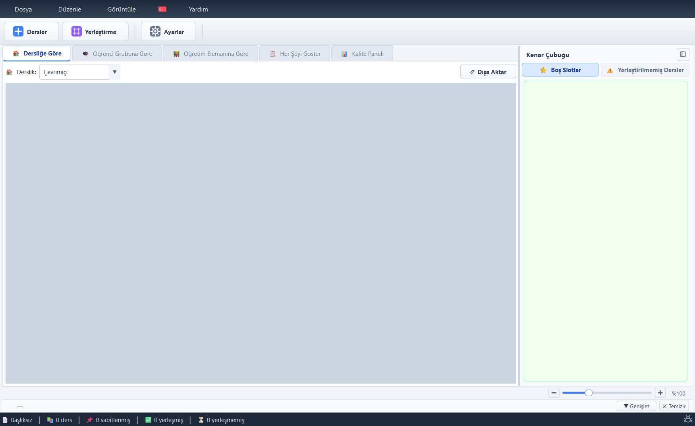

The shell is clean and consistent (dark menubar, white card toolbar) but has discoverability gaps. The toolbar's **Dersler** and **Yerleştirme** buttons are InstantPopup menus whose dropdown arrow is explicitly suppressed (`QToolButton::menu-indicator { image: none; }`, app.py:243-247), so they are indistinguishable from **Ayarlar**, which is a plain action. The Language menu appears as a bare flag with no title (app.py:990-1002). The toolbar duplicates the Edit menu's Classes/Placement submenus verbatim — acceptable redundancy, but the two surfaces present the same commands differently (menu shows shortcuts, toolbar tooltips show only one).

The status bar (app.py:1853-1868) renders five counters; `n_unplaced = total - pinned - placed` (line 1861) goes **negative** when pinned classes carry `placed=True` — observed as `-5 yerleşmemiş` (evidence/ux-large-everything.png). Its 'yerleşmiş' figure (placed only) disagrees with the dashboard's 'Yerleşti' (placed∪pinned, analytics.py:197-202) on screen at the same time. Toast feedback (widgets.py:45-53) positions itself in global coordinates computed from parent-local math and appears at the wrong screen position whenever the window is not at the display origin — measured exactly the window-offset (500,330) away in the probe.

## Timetable views (By Classroom / Group / Lecturer)

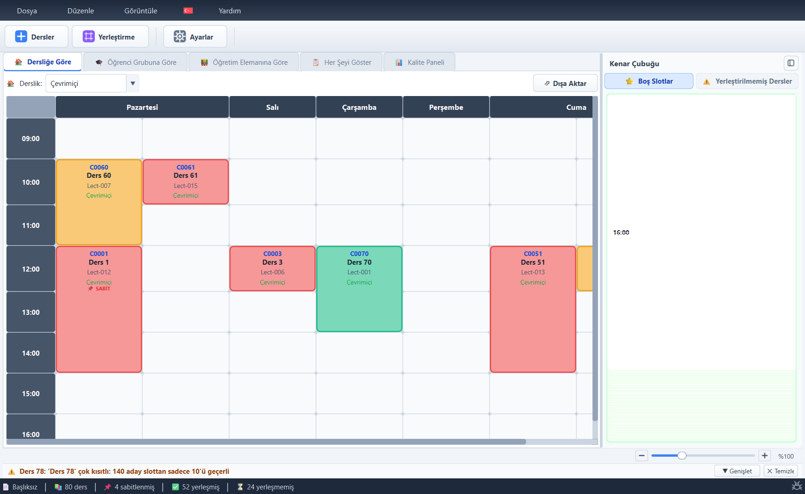

The grid itself is attractive: rounded cells, adaptive row heights, per-view zoom (25–300%), tooltips, drag with green/red validity overlay. Critical problems:

1. **Conflicts are invisible** (renderer.py:117-131): occupancy is a plain `(row,col)` dict — the last-written class wins and the other renders nowhere. Verified by hand-placing two classes at monday/09:00/R001: only `C0002` renders in both the room view (evidence/ux-stress-conflict-r001.png) and the group view (evidence/ux-stress-conflict-group.png) while the status bar counts all three placed classes. No conflict indicator exists anywhere in the product.
2. **Color = year, never explained**: cell color derives from the first target's year (logic.py:485-489). No legend exists in any screen; online classes are marked only by the word 'Çevrimiçi' in the same green as room codes.
3. **Contrast**: room text #16A34A on the standard cell backgrounds is 1.55–2.14:1, the 'SABİT' badge 2.3:1, class code 3.4:1, lecturer 3.8:1 — all below WCAG AA for their sizes; only the class name passes (7.4:1).
4. **Selection** is a 2px→3px black border change (renderer.py:370-371) — very subtle; there is no hover paint state.
5. **Extreme content**: a 223-char name grows its row ~5x across all days (evidence/ux-stress-longname-200char.png); sequential cells instead clip names without ellipsis, omit the room entirely, and label segments with the branch letter only — 'A' is ambiguous between Year-1/A and Year-2/A.
6. At 1400px the tab bar already truncates ('Kalite' + scroll arrows, evidence/ux-tab1-group.png).

## Show Everything (matrix view)

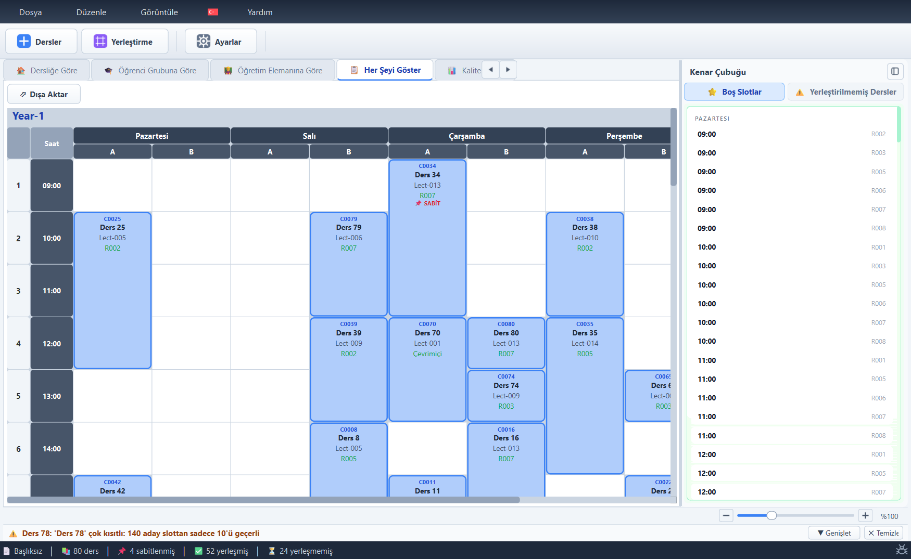

The year × branch × day matrix is information-dense and reads well at 'normal' scale. The same silent conflict-overwrite pattern applies at `(slot,day,branch)` keys (renderer.py:200-209). At the 'large' preset (6 years × 3 branches) roughly 3.5 of 5 days fit at 1400px; horizontal scrolling is the only recourse because the day sub-columns have fixed minimum widths (evidence/ux-large-everything.png). Only Year-1's section is visible without vertical scrolling; there is no jump-to-year navigation or collapsed-year mode. Ctrl+C copy works per-tab here but **crashes with IndexError on the Dashboard tab** (app.py:3757-3802 maps tabs 0-3 only — verified by the shell audit's probe).

## Dashboard (Kalite Paneli)

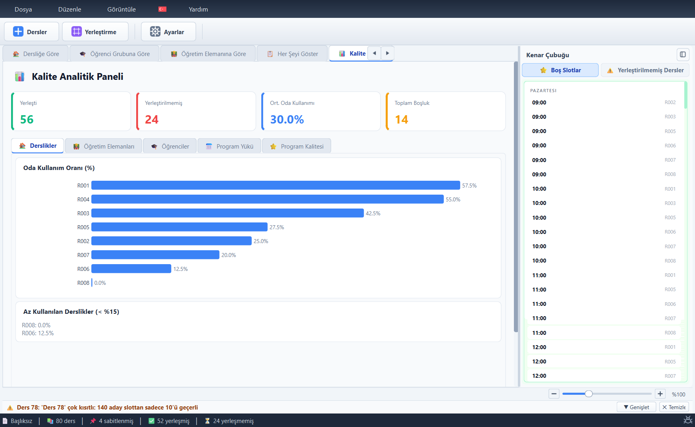

Four metric cards + five analytics tabs; lazily refreshed only when visible (good). Issues: the 'Yerleşti 56' card contradicts the status bar's '52 yerleşmiş / 4 sabitlenmiş' visible in the same frame — different definitions of 'placed' (analytics.py:201 vs app.py:1857). The quality gauge feeds `cls.get("room","")` — a nonexistent key — zeroing room-based score components (dashboard.py:441, confirmed by the dialogs briefing), so the dashboard grade diverges from the grade in BulkResultsDialog. The dashboard's inner tab bar truncates at 1000px into an icon + scroll arrows (evidence/ux-narrow-1000x700-dashboard.png). Room bar chart labels overlap the sidebar boundary at narrow widths.

## Sidebar: Open Slots and Unplaced panels

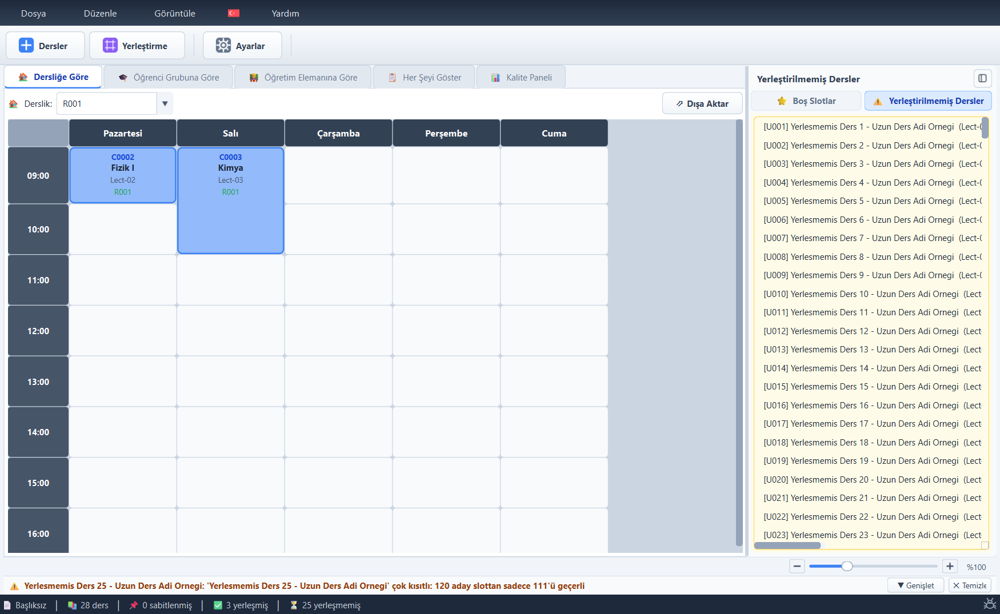

The two-page sidebar is a strong concept (open slots filtered to the selected class; drag-to-unplace on the tab button). Defects: Open Slots rows have a pointing-hand cursor and hover highlight **but no click handler** (app.py:2932-2941) — a pure false affordance where 'click to place here' is the natural expectation; the panel rebuilds every row widget on each refresh/selection change; room labels are #9CA3AF 7.5pt (≈2.5:1 contrast). The Unplaced list with 25 items is usable but items clip at the right edge without ellipsis (horizontal scrollbar instead), there is no count badge on the tab, no sort/group controls, and no bulk 'place all' affordance inside the panel (it exists only in the toolbar menu as Ctrl+P). The sidebar keeps ~350-430px width at all window sizes, starving the grid at 1000px (evidence/ux-narrow-1000x700.png).

## Warning log panel

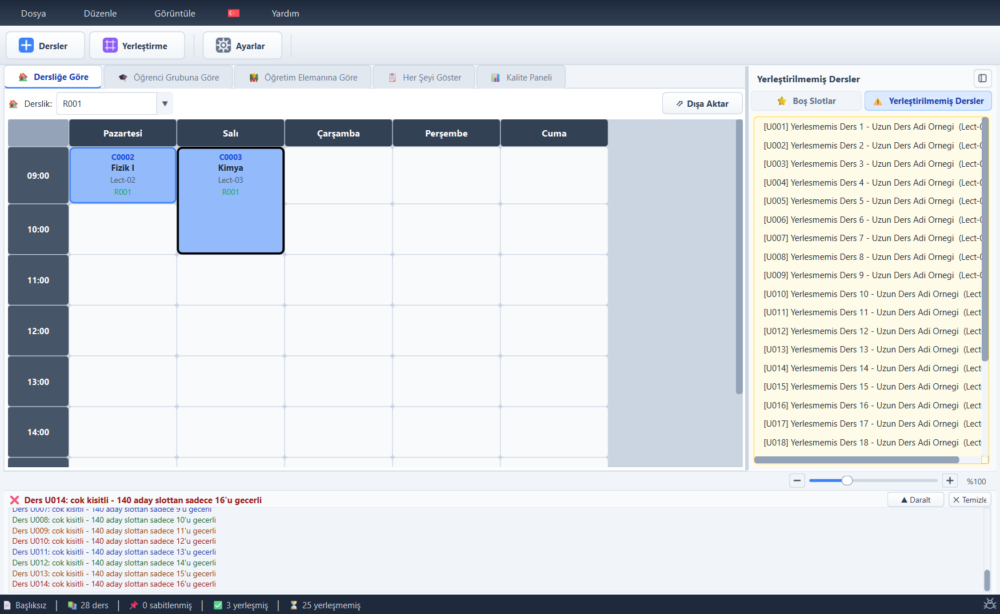

Collapsed to a single latest-message line (30px); expandable to only 120px. Messages re-log on every refresh with no de-duplication or timestamps (widgets.py:213-239, app.py:2964-3061), the log grows unbounded per session, and message templates repeat the class name twice ('Ders X: \'X\' çok kısıtlı…'). Kind is encoded by text color alone in the expanded list (blue/orange/red) — with the ratios passing AA on this background, but no icons per line. 'Genişlet/Daralt' and 'Temizle' are the only controls; there is no filter, no click-to-navigate from a warning to the affected class.

## SetupDialog (4 tabs)

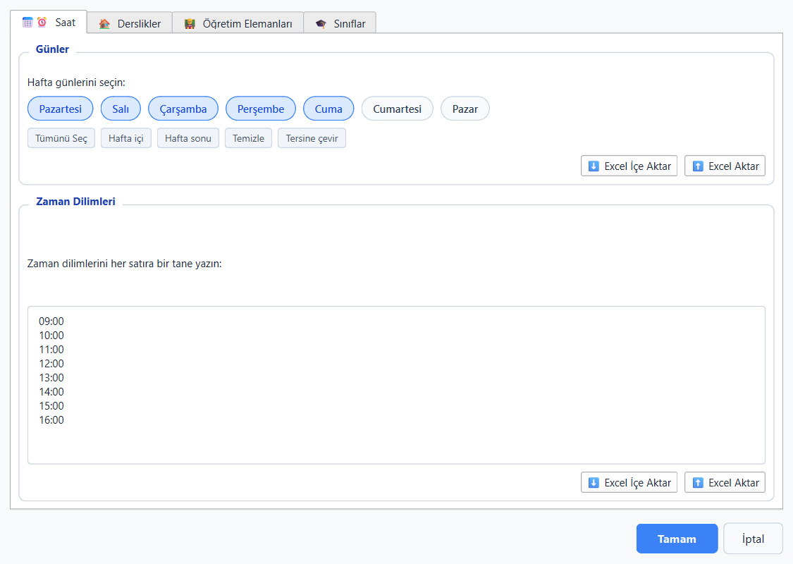 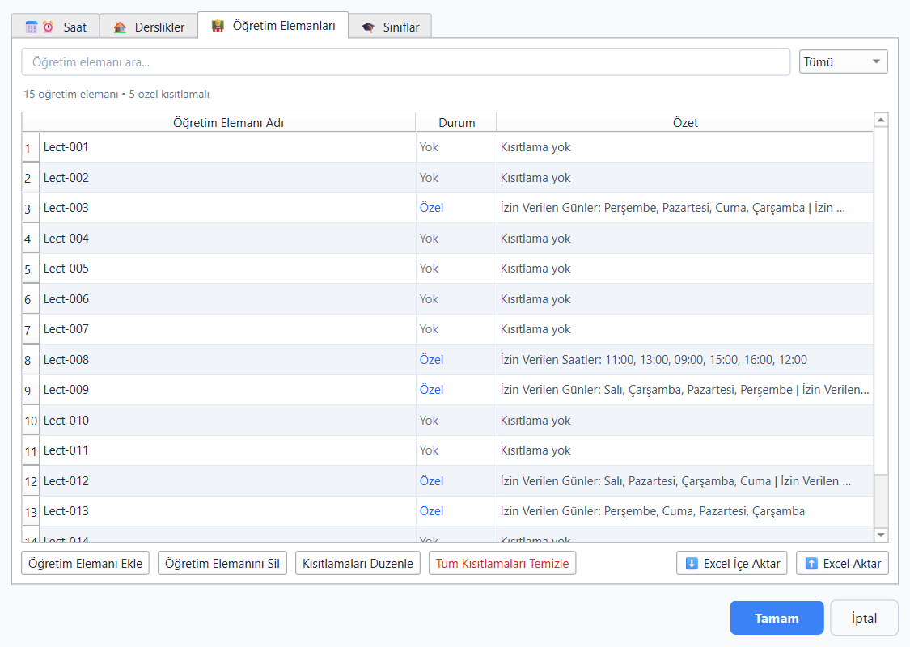

Day selection uses toggle chips with quick actions (good). **Time slots are a free-text multiline box** — 'one per line', no format validation, no dedup, no ordering enforcement (dialogs.py:1760), while the entire scheduling engine indexes rows by `slots.index()`; any typo silently deforms every view. The lecturers tab is a competent master-detail (search, status column, constraint summaries) but 'Özel'/'Yok' status is color-text only, summaries list days in unsorted storage order, and renaming a lecturer silently discards their availability (dialogs.py:1789-1797 — from the dialogs briefing, verified against code). Excel button pairs read 'Excel İçe Aktar' vs 'Excel Aktar' — a one-word distinction between opposite operations. OK applies wholesale overwrites of 7 state keys with **no reconciliation of already-placed classes and no undo**, and classes placed on removed days/slots silently disappear from rendering (renderer.py:86-88).

## AddClassDialog / BulkAddDialog / EditClassesDialog

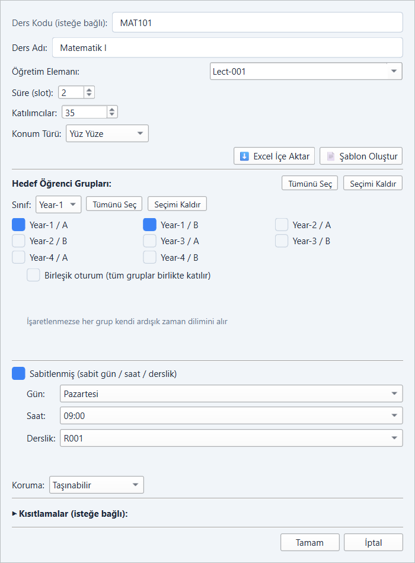 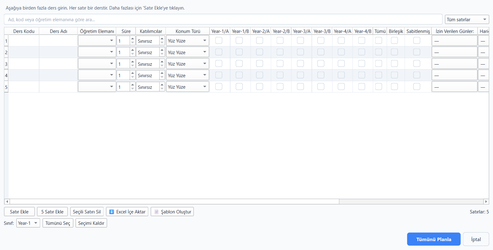 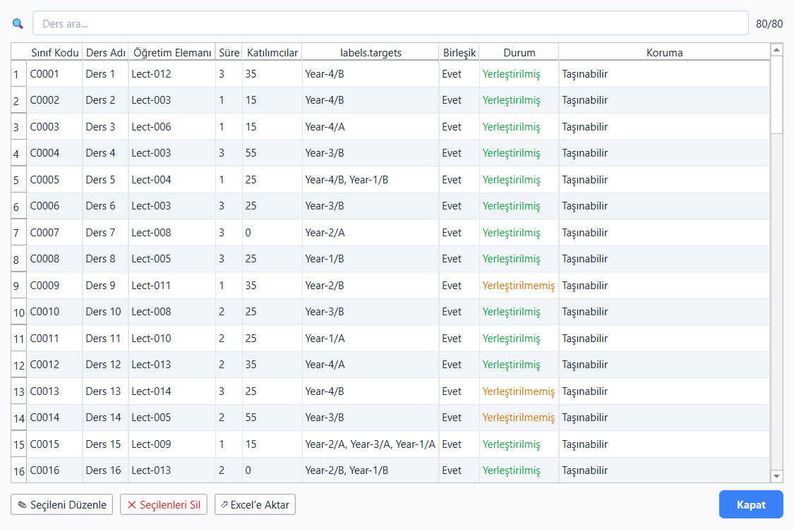

**AddClass**: scrollable single-column form; labels/fields are ragged (per-row HBoxes) except the pinned section (QFormLayout); no required-field markers; validation shows only the FIRST error in a modal (dialogs.py:2526-2529); Excel import buttons float mid-form. The editable lecturer combo accepts arbitrary new names that never join `state['lecturers']`, so availability never applies to them (dialogs.py:2509).

**BulkAdd**: genuinely powerful spreadsheet grid (undo/redo, paste, per-row targets) but needs >1500px to show all columns — constraint columns live beyond a horizontal scroll with no frozen name column; per-branch checkbox columns explode at institutional scale (18 columns at 6×3). Known stale-row-capture bug on the location-type combos after row deletion (dialogs.py:3260-3277).

**EditClasses**: search + table + bottom actions. Header literally shows **'labels.targets'** — an untranslated key, missing in all 22 languages (evidence/ux-dlg-editclasses.png). Header says 'Sınıf Kodu' where AddClass says 'Ders Kodu'. Deletions confirm, then show a second info popup, but mutate state immediately; the dialog offers only 'Kapat' — no cancel semantics.

## Placement & results dialogs (PlaceClass, PostAdd, BulkResults, Reschedule)

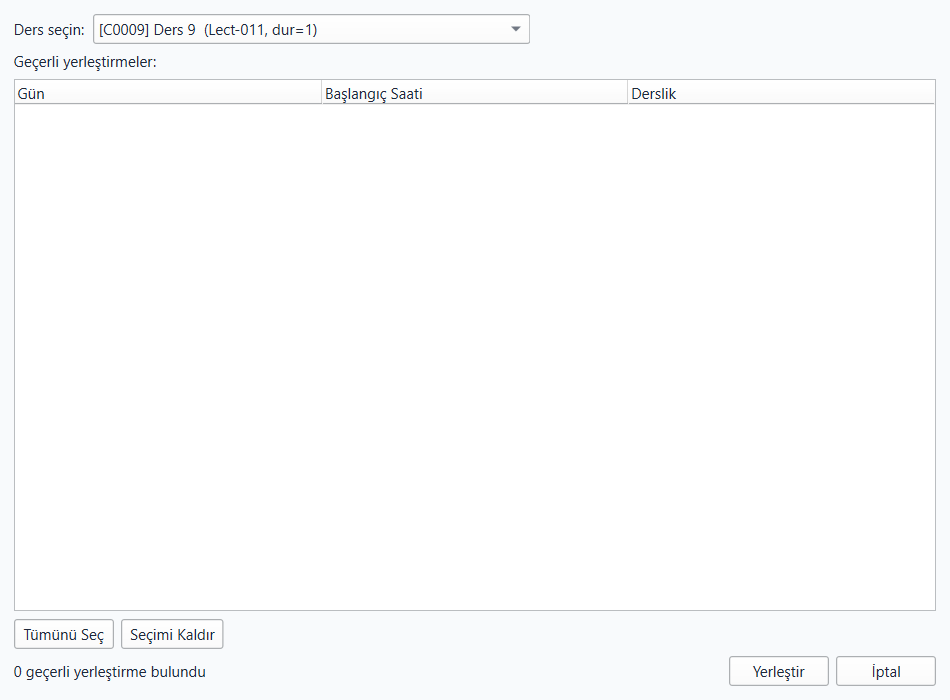 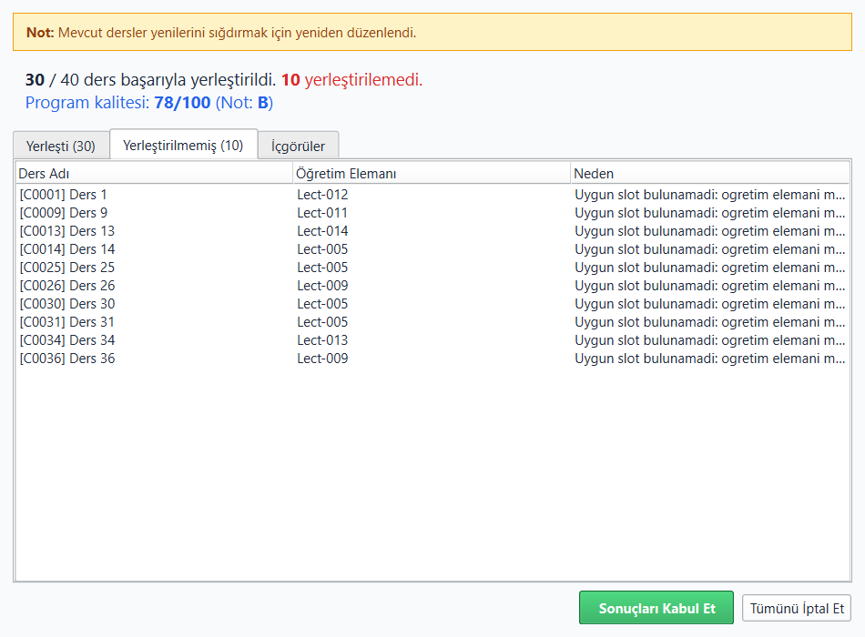 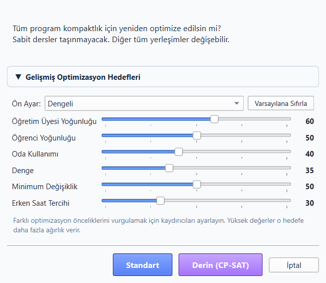

**PlaceClass** dead-ends on its most important case: '0 geçerli yerleştirme bulundu' renders an empty table with no reason, no negotiation suggestions (which the app computes elsewhere), and an enabled 'Yerleştir' button. **PostAdd** lists 37 day/time/room rows with no score/recommendation column and a oddly-phrased primary button ('Şimdi yerleştir?'). **BulkResults** is good (placed/unplaced/insights tabs, clear accept vs discard buttons) though unplaced reasons truncate with '…' and insight icons are ASCII '[!]' markers. **Reschedule** hides a well-made 6-slider goals panel behind a collapsed toggle (good default) but offers 'Standart' vs 'Derin (CP-SAT)' as two equally-primary buttons with unexplained jargon — and the chosen solve runs synchronously on the UI thread, freezing the window during CP-SAT phases.

## System feedback: bug/crash dialogs, upgrade, tutorial

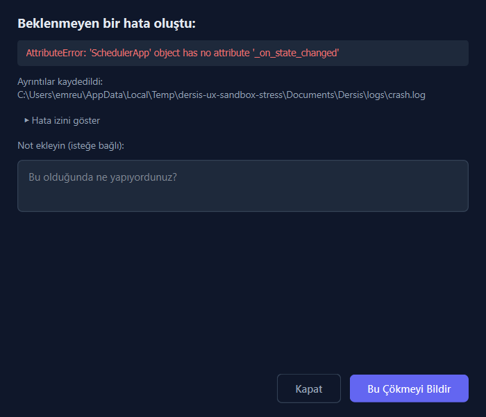 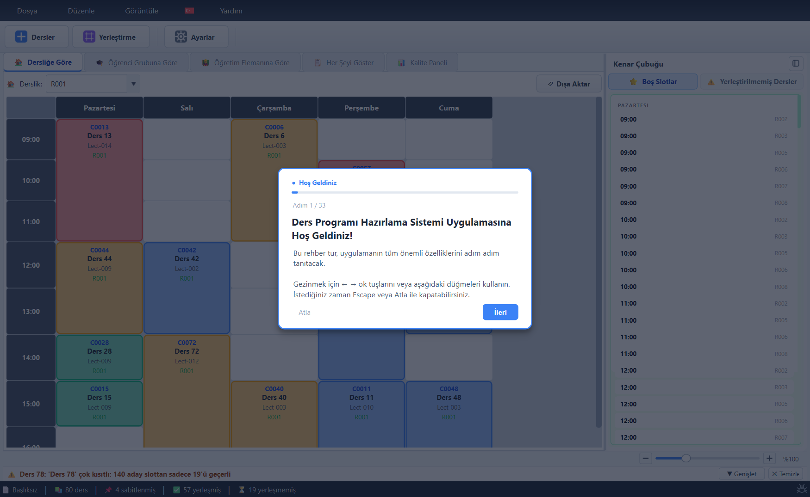

The bug/crash dialogs are **dark-themed in a light-only app** — a jarring brand break at the moment of failure — and show raw English tracebacks plus a username-bearing local path to Turkish users; button order (İptal left, primary right) inverts the Tamam/İptal order used elsewhere. The mailto-based privacy design itself is sound. UpgradeDialog is well-formed but dormant (tier pinned institutional) and can interpolate untranslated entity names into localized sentences ('Lecturers sınırına ulaştınız', evidence/ux-dlg-upgrade.png); tier_enforcement.py:331 builds a hardcoded English tooltip. The auto-tutorial is thorough (33 steps, 11 sections, progress bar, keyboard nav — 'Adım 1 / 33') but fires over an empty dataset before setup, and 33 steps up-front is heavy cognitive load; there is no per-feature contextual help.

## Accessibility & keyboard audit

Systematic code + probe findings:

- **Zero** accessibility API usage in the package (no setAccessibleName / QAccessible anywhere); the timetable is custom-painted QGraphicsItems — screen readers perceive an empty canvas.
- **No keyboard path into the grid**: renderer.py contains no keyPressEvent/focus handling; selection requires a mouse click, movement requires drag or a right-click context menu. Menu/dialog flows (Ctrl+P place, Ctrl+U unplace) provide partial keyboard-only coverage, but cell-level operations (move to a specific slot) have none.
- **Contrast** (computed from painted hexes): room label 1.55–2.14:1 FAIL; SABİT badge 2.27–2.45:1 FAIL; class code 3.40:1 FAIL; lecturer 3.84:1 FAIL; name 7.42:1 PASS; open-slots room 2.5:1 FAIL; warning-log text 6.5–8.0:1 PASS; sidebar inactive tab 4.34:1 borderline.
- **Color-only encodings**: year (only grouping cue), lecturer-status 'Özel' (blue text), warning-log kind (text color). Pinned/protection badges do add text+emoji (good pattern to extend).
- **Targets**: grid cells and toolbar are comfortably large; small controls (zoom ±, warning-log buttons ~20px tall, sidebar collapse 28px) are desktop-acceptable.
- Dialogs rely on creation-order tab sequence (no setTabOrder) which is mostly correct; MultiSelect/tree dialogs support Ctrl+A.

## Responsiveness audit (1000×700 and minimum size)

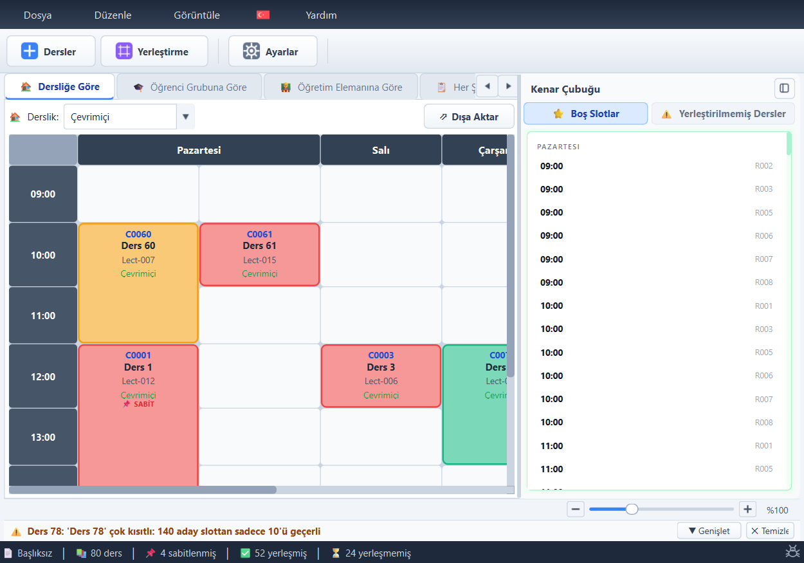

At 1000×700: tab bar shows ~3 of 5 titles with scroll arrows; the sidebar retains ~430px (43% of width) so the grid shows 2.5 day columns; the dashboard's inner tabs collapse to an icon; the warning bar and status bar survive intact. The declared minimum (850×550, app.py:809) is below what several dialogs need (BulkAdd min 950×650, EditClasses 900×560). Nothing reflows — the layout strategy is fixed sidebar + scrollbars, so on the 1366×768 laptops common in schools the daily working view will be cramped and horizontally scrolled. Recommended: proportional splitter defaults, sidebar auto-collapse breakpoint, icon-only tabs at narrow widths.

## Improvement proposals

### Proposal 1

P1 — Conflict-aware cells (fixes silent double-booking). Current problem: renderer drops one of two overlapping lessons (renderer.py:117-131, 200-209); users ship schedules with invisible lessons. Proposed behavior: occupancy map keeps a LIST per cell; 2+ entries render as a vertically split cell with a red border and a 'ÇAKIŞMA' pill; each conflict logs one warning-log entry with click-to-navigate; export layers refuse/annotate conflicted cells. Priority: Critical.
Cell (conflict)
├── header strip  [⚠ ÇAKIŞMA 2]          (red pill, white text)
├── sub-block A   [C0002 Fizik I · Lect-02 · R001]
├── divider (red dashed)
└── sub-block B   [XX9999 İleri… · Lect-01 · R001]

### Proposal 2

P2 — One placement vocabulary (fixes 56 vs 52+4 vs -5). Current problem: three definitions of 'placed' and a formula that renders negative counts (app.py:1861; analytics.py:201-202). Proposed: core exposes schedule_counts(state) -> {scheduled, pinned_of_scheduled, unscheduled}; status bar, dashboard cards, and BulkResults all consume it; status bar shows pinned as a subset annotation, not a separate additive bucket. Priority: High.
StatusBar
└── 📄 file │ 📚 80 ders │ ✅ 56 yerleşti (📌 4 sabit) │ ⏳ 24 yerleşmedi
Dashboard cards
├── Yerleşti 56   (same source)
└── Yerleşmedi 24 (same source)

### Proposal 3

P3 — Legend + redundant encodings (fixes color-only grid, contrast failures). Current problem: year color is the only grouping cue, unexplained; room/badge text fails WCAG. Proposed: legend strip above the grid; in-cell secondary text darkened to ≥4.5:1 with tiny glyphs (🏫 room, 📌 pinned as filled pill w/ white text, 🌐 online); year/branch text added to joint cells; optional color-blind-safe palette in View menu. Priority: High.
Timetable tab
├── filter row  [Derslik: R001 ▾]              [Dışa Aktar ▾]
├── legend row  [■ Year-1] [■ Year-2] [■ Year-3] [■ Year-4] [🌐 Çevrimiçi] [📌 Sabit]
└── grid
    └── cell
        ├── C0013 (dark blue ≥4.5:1)
        ├── Ders 13 — Year-4/B
        ├── Lect-014 (#334155)
        └── [🏫 R001] [📌 SABİT]  (filled pills, white text)

### Proposal 4

P4 — Keyboard grid navigation + AT exposure (fixes mouse-only core). Current problem: no keyboard or screen-reader access to the timetable (renderer.py has zero key/focus handling; 0 accessibility APIs in package). Proposed: TimetableView gets a cell cursor — arrows move, Enter opens the cell's context menu, F2 edits, Ctrl+X/Ctrl+V unplace/place-at-cursor with the existing validity check painting green/red on the cursor cell; cursor cell drawn with a 2px focus ring; each lesson/empty cell gets an accessible name ('Pazartesi 09:00, R001: Ders 13, Lect-014, sabit'). Priority: High.
TimetableView (focus)
├── cell cursor ring (2px #1D4ED8, follows arrow keys)
├── Enter → context menu (Edit/Unplace/Protection/Remove)
├── Ctrl+X → lift class (ghost) → arrows → Ctrl+V place (validity colors reuse _check_drop_valid)
└── Esc → cancel lift, restore

### Proposal 5

P5 — Responsive shell (fixes 1000px degradation). Current problem: fixed ~350-430px sidebar + long tab titles leave 2.5 day columns at 1000px; dialogs exceed the app's own minimum window. Proposed: splitter sizes proportional (sidebar 25%, max 360px); below 1180px sidebar auto-collapses to the existing 36px rail with flyout on hover/click; tab bar switches to icon+short-label under 1250px ('Derslik', 'Grup', 'Öğr. Elemanı', 'Tümü', 'Kalite'); raise main-window minimum to 1024×640 and cap BulkAdd min width to available screen. Priority: Medium.
MainWindow @ <1180px
├── toolbar (unchanged)
├── tabs [🏫 Derslik][👥 Grup][🎓 Öğr.][▦ Tümü][📊 Kalite]  (short labels, no scroll arrows)
├── splitter
│   ├── grid (≥75%)
│   └── sidebar rail (36px) ⇄ flyout 320px overlay
└── warning bar / status bar

---

## Cross-references

- The invisible-conflict defect ([ST-UI-001](12-findings-register.md#st-ui-001))
  is the UI face of the scheduler producing overlaps
  ([ST-SCHED-001](12-findings-register.md#st-sched-001),
  [ST-SCHED-002](12-findings-register.md#st-sched-002)) — the engine can create a
  double-booking and the grid will hide it.
- Counter disagreement ([ST-UI-002](12-findings-register.md#st-ui-002)) and
  zeroed room metrics ([ST-UI-003](12-findings-register.md#st-ui-003)) are the
  analytics-correctness findings from [08](08-error-edge-case-audit.md).
- SetupDialog wholesale-overwrite with no reconciliation is
  [ST-DATA-004](12-findings-register.md#st-data-004); it is the normal-UI trigger
  for the slot-removal crash [ST-DATA-003](12-findings-register.md#st-data-003).
- The synchronous solve that freezes the window during reschedule is the
  performance finding [ST-PERF-001](12-findings-register.md#st-perf-001).
- Warnings-panel and CSV injection are [ST-UI-007](12-findings-register.md) /
  [ST-UI-008](12-findings-register.md) (see also [security](11-security-resilience-notes.md)).

The five improvement proposals above (P1–P5) map to roadmap items in
[14-implementation-roadmap.md](14-implementation-roadmap.md); consolidated UX
opportunities are in [13-improvement-opportunities.md](13-improvement-opportunities.md#ux-improvements).
